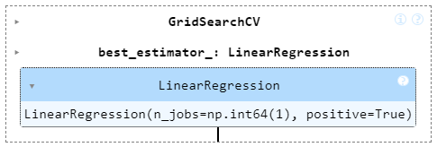
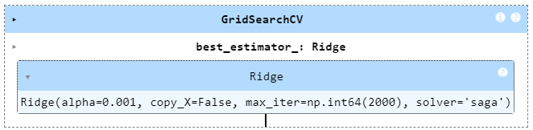

# <center><i>Prasunet Company Machine Learning Project - 01</i></center>

# <center>House Prices Prediction</center>

## Objective 🏠
The goal of this project is to develop a linear regression model to predict the prices of houses based on their square footage, number of bedrooms, and number of bathrooms. This predictive model can be used by real estate agents, potential buyers, and sellers to estimate the market value of a property.

---

## About the Dataset 📊

- Download the dataset from here: [Kaggle Dataset](https://www.kaggle.com/datasets/muhammadbinimran/housing-price-prediction-data) 

<center></center>
<br>

Explore the fascinating world of housing price prediction with this synthetic dataset. Perfect for data science enthusiasts, machine learning practitioners, and Kaggle learners, this dataset offers a diverse collection of features, including square footage, bedrooms, bathrooms, neighborhood types, and the year of construction. Immerse yourself in the challenge of predicting house prices and enhance your skills in regression analysis

## Key Variables 🏡

- `SquareFeet` - Square feet of the house
- `Bedrooms` - Total number of dedrooms
- `Bathrooms` - Number of bathrooms/restroom/washroom.
- `Neighbourhood` - area neighborhood where the house is
- `Year Built` - which year it was built
- `Price` - The price of the house.
<br>

## Training Dataset 📊

As per the instructions given, the model to be trained should be a Linear Regression model, which is to be trained on square footage, number of bedrooms, and number of bathrooms.

### Features 🧩

- `SquareFeet` - Square feet of the house
- `Bedrooms` - Total number of dedrooms
- `Bathrooms` - Number of bathrooms/restroom/washroom.
- `Price` - The price of the house.

<br>

## Models 🤖

<div style="text-align:center;">
    <div style="display:inline-block; margin: 20px;">
        <h3>Linear Regression Model</h3>
        
    </div>
    <div style="display:inline-block; margin: 20px;">
        <h3>Ridge Regression Model</h3>
        
    </div>
</div>


## Model Evaluation 🤖

### <center><i>Training Data Performance</i> 📈</center>
<center></center>


### <center><i>Test Data Performance</i> 📈</center>

<br>

## How to Set Up This Project 🛠️

This guide walks you through setting up the project's environment.

**1. Install Python 🐍**

If you don't have Python installed yet, head over to the official download page: [Python Download Guide](https://wiki.python.org/moin/BeginnersGuide/Download) and follow the instructions for your operating system (Windows, macOS, or Linux).


**<u>Optional: Creating a Virtual Environment</u>**

1. Install virtualenv (if not already installed):

   If you haven't installed virtualenv, you can do so using pip:
    ```bash
    pip install virtualenv
    ```
2. Create a virtual environment:

    In the terminal and run this command:
    ``` bash
    virtualenv venv
    ```

3.  Activate the virtual environment:

    To activate the virtual environment:
    ``` bash
    venv\Scripts\activate
    ```


**2. Download the Repo 📥**


1. Open your Git client or terminal.
2. Navigate to the directory where you want to clone the repository.
3. Run the following command, replacing `<repository_url>` with the actual URL of the project's repository:

```bash 
git clone <repository_url>
```

**3. Install required Dependencies  📦**
1. Open terminal/cmd.
2. navigate to repo directory
3. Run the following command to install dependencies from requirements.txt:

``` bash
pip install -r requirements.txt
```

**4. Host the project Locally 🌐**

- After installing the required dependencies, run the following command to start the project locally:

``` bash
streamlit run server.py
```

